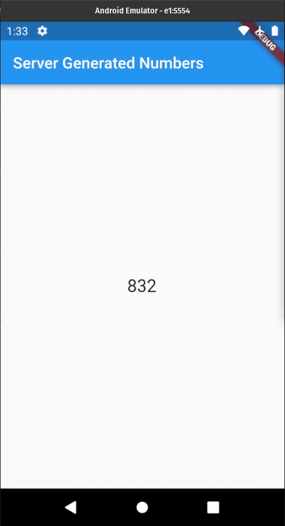

# Random Numbers App

#### An example of streaming random numbers generated by the Askless Backend (Node.js) to the Flutter App

This is the server side in Node.js,
**[click here](https://github.com/RodrigoBertotti/askless-flutter-client/tree/dev/example/random_numbers)**
to access the client side in Flutter

 
